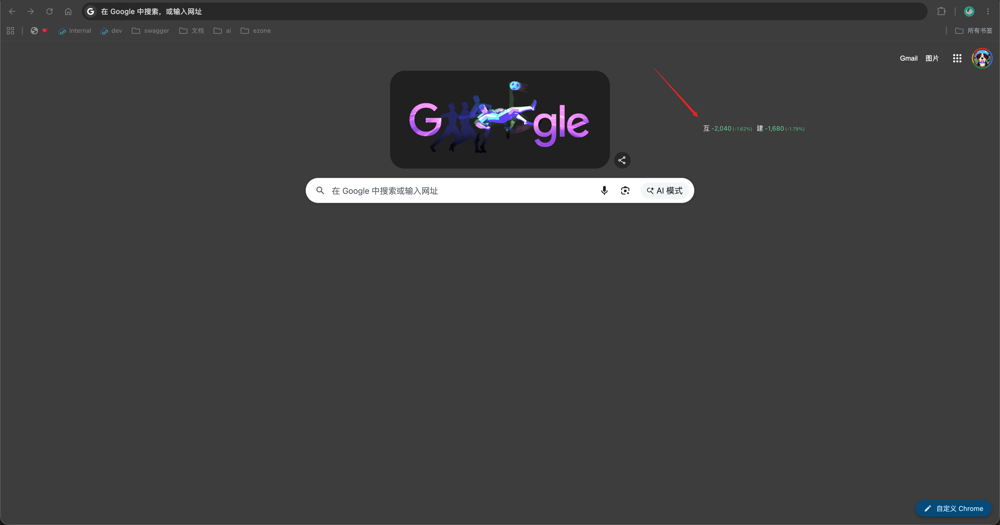
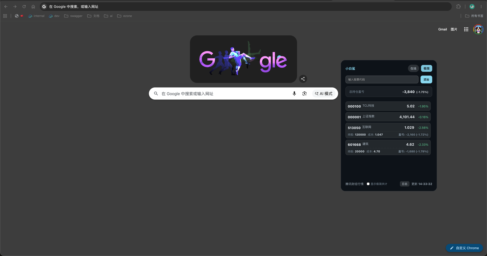

# 🦈 小白鲨 (Xiaobaisha)
> 一个基于 Tauri 2.0 + React 开发的桌面看盘小玩具。
> 💡 本项目完全由 Vibe Coding 编写而成。

---

## 📸 效果截图

### 极简模式 (挂件模式)


### 普通模式 (窗口模式)


---

## ⌨️ 快捷键

- **全局唤起/隐藏窗口**：
  - **macOS**: `Command + Shift + E`
  - **Windows / Linux**: `Win + Shift + E`

---

## 🛠️ 克隆并运行 (感兴趣的自己 Clone 运行即可)

> ⚠️ **说明**：本项目仅在 macOS 系统下开发测试过，Windows / Linux 环境未进行过验证，感兴趣的可以自己 Clone 尝试运行。

### 1. 环境准备
确保您的电脑上已安装：
- [Node.js](https://nodejs.org/) (推荐 v18+)
- [Rust 编译环境](https://www.rust-lang.org/) (Tauri 2.0 依赖 Rust)

### 2. 获取代码与安装依赖
```bash
# 克隆仓库并进入目录
git clone https://github.com/janglikv/shaxiaobai
cd xiaobaisha

# 安装 Node 依赖
npm install
```

### 3. 开发模式运行
```bash
npm run tauri dev
```

### 4. 生产打包
```bash
npm run tauri build
```

---

*声明：本应用仅作为一个看盘娱乐的桌面玩具，不构成任何投资建议。*
